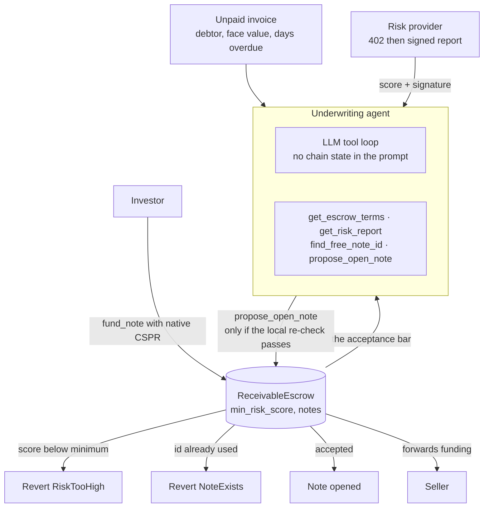

# Invoice Factoring Agent

**An unpaid invoice becomes a funded receivable note, and the underwriter never
gets to pick its own acceptance bar.**

An AI agent reads the escrow's terms **from the contract**, buys a signed risk
score over an x402-style endpoint, and opens a receivable note. Investors fund
notes with native CSPR, which the escrow forwards to the seller.

**Repository:** [github.com/pranjalcodesinw3/casper-invoice-factoring-agent](https://github.com/pranjalcodesinw3/casper-invoice-factoring-agent)

---

## Why this is not the other 77 finalists

Most agentic underwriters in this field decide with a fixed if-ladder in
TypeScript while an LLM writes prose next to it. Here the model gets no chain
state in its prompt: it must call `get_escrow_terms` to learn the minimum risk
score the contract enforces, `get_risk_report` to buy signed debtor data, and
`propose_open_note` to act.

Three layers must agree before a note opens:

1. the model chooses to call `propose_open_note`
2. this process re-checks the request against live contract state
3. the contract re-checks `min_risk_score` and note uniqueness, and reverts

Only the third is authoritative. The first two exist so a failure is cheap and
legible instead of costing gas. A test asserts that changing only the *on-chain*
threshold flips the outcome for an identical tool call, which is what "the model
does not set the bar" actually means.

---

## Architecture



---

## Run it in under 5 commands

```bash
git clone https://github.com/pranjalcodesinw3/casper-invoice-factoring-agent && cd casper-invoice-factoring-agent
(cd contract && rustup toolchain install nightly-2026-01-01 --profile minimal && cargo test)
(cd agent && npm install && npm test)
```

39 contract tests and 50 agent tests, fully offline: no API key, no node, no
secret. To run the flow locally, start the risk provider with
`cd agent && npm run provider`, then `npm run cli:good` (or `cli:risky` to watch
it refuse) in a second shell.

---

## On-chain proof

Casper **testnet** (`casper-test`).

| What | Hash | Status |
|---|---|---|
| Package (v2, live) | `c22bbc3276256cc3fd1a2bc7eaa95464216cfbf0d938676edbdb9d8d9dd2c48a` | [contract-package](https://testnet.cspr.live/contract-package/c22bbc3276256cc3fd1a2bc7eaa95464216cfbf0d938676edbdb9d8d9dd2c48a) — 13 entry points |
| Contract (v2, live) | `7125550f8500c097e974b95d4bc53c4afb5f3db05d40ca7de9edf7f37092d56f` | live, the one the app calls |
| Package (v1, superseded) | `1c7b0dfe3d37d1c7acaed683b5e0f6183fe144c5daa39a361b6d3b50d850efec` | [contract-package](https://testnet.cspr.live/contract-package/1c7b0dfe3d37d1c7acaed683b5e0f6183fe144c5daa39a361b6d3b50d850efec) — 7 entry points, kept for its refusal receipts |

### The bond lifecycle, driven from the web UI

Every hash below was signed in a browser wallet on `/desk` and broadcast by
the app. The order is the argument: `post_bond` has to come first, because
`open_note` checks `is_bonded` before it looks at the risk score.

| Step | Deploy | Result |
|---|---|---|
| `post_bond` (10 CSPR, the contract minimum) | [`6f0ba0c4…`](https://testnet.cspr.live/deploy/6f0ba0c4200c1ea0852548887928593d6408a4e6ae3589dd39cd426ed036560f) | executed |
| `open_note` (risk 82 ≥ min 50, bonded) | [`41401fc8…`](https://testnet.cspr.live/deploy/41401fc88b0c9ef903616f777a0daa4bc91a398ecc702280e74f0e17458fcf82) | executed |
| `fund_note` (15 CSPR, exact face value) | [`4102e72e…`](https://testnet.cspr.live/deploy/4102e72eca8572abc580e31c3293288b47a7063d36fd3fd0925d2bf0aea0bd8e) | executed |
| `mark_repaid` | [`8c6e3313…`](https://testnet.cspr.live/deploy/8c6e33135cab0d7df58fa94de0848b3e470c7f0197a59132d22e83ebce2a447a) | executed |
| `declare_default` (bond slashed to the investor) | [`54d5f236…`](https://testnet.cspr.live/deploy/54d5f236641cc758e151dcd0e93beabac40bf77a3ff3b2eb91cede3b08cbf637) | executed |

After the slash the contract reports `stakedMotes 0`, `slashedMotes
10000000000`, `defaults 1`. The note's face value was 15 CSPR and the stake was
10, so the investor was paid 10 and the shortfall is visible rather than
smoothed over. That cap is the whole point, and it is observable from outside
the contract.

**The full lifecycle executes on chain.** A note is opened, funded with real
CSPR, and marked repaid, and every refusal path reverts with its own typed
error code. Every hash below is in [`PROOF.json`](PROOF.json) and is
reproducible with one command:

```bash
cd agent && CASPER_NODE_URL=https://node.testnet.casper.network/rpc \
  OWNER_SECRET_KEY_PATH=/path/to/secret_key.pem npx tsx scripts/prove.ts
```

| Step | Deploy | Result |
|---|---|---|
| `open_note` (risk 80 ≥ min 50) | [`e09ad580…`](https://testnet.cspr.live/deploy/e09ad580159e2a6c66bb09e408c2153b1eed3c2cfc023b298fe45ef623022051) | executed |
| `fund_note` (exact 1 CSPR) | [`2233b2d0…`](https://testnet.cspr.live/deploy/2233b2d0216adaf8eff0b6dc697e076590f68e6762acce21c210e6d94b528b88) | **executed**, block 8624223 |
| `mark_repaid` (after funding) | [`f4445403…`](https://testnet.cspr.live/deploy/f44454033fa3bab01fed57480842bc4fdf05fdaac9219e40668aa17937befcbb) | **executed**, block 8624224 |
| `open_note` (risk 10 < min 50) | [`ffd87d19…`](https://testnet.cspr.live/deploy/ffd87d1929d92da2c71e0f891fbd1d092cf13bb3a16221e2a65b02e06883ddd9) | reverted **3 RiskTooHigh** |
| `open_note` (duplicate id) | [`8cfa58a1…`](https://testnet.cspr.live/deploy/8cfa58a15205f1a047eacb4648ba11e52a1242ffe1ec7dd8fc97124f1e33e765) | reverted **2 NoteExists**, block 8624216 |
| `fund_note` (no such note) | [`341fee9b…`](https://testnet.cspr.live/deploy/341fee9bd9cfb0ddf7c5be227fd272484e67897ff75759026c1ed08ab04c5774) | reverted **4 NoNote**, block 8624217 |
| `fund_note` (0.5 against a 1 CSPR note) | [`eca04e20…`](https://testnet.cspr.live/deploy/eca04e20cedd59fb1ec108fa8bbc4c22a0bbd0f0cc135f335c8a5b701fae2d21) | reverted **6 WrongAmount**, block 8624219 |
| `mark_repaid` (note still open) | [`7282fcc6…`](https://testnet.cspr.live/deploy/7282fcc69456074f53f83f8269164a4609f146bff619fd3d15c1c5126da608c4) | reverted **7 NotFunded**, block 8624221 |

Five distinct enforced rejection codes (2, 3, 4, 6, 7), each from a scenario
built so exactly one clause can fail, which is what makes the code
attributable. A revert whose code is at or above Odra's `MaxUserError`
(64535) is *not* counted: those are argument-deserializer or runtime failures
that never reached contract logic. `Insufficient funds` is likewise not a
failure path; it means the account was broke, not that the contract enforced
anything.

### Funding a `payable` entrypoint

`fund_note` is `#[odra(payable)]`, and this is the part that is easy to get
wrong. Odra does **not** read an `amount` runtime argument. It reads a
`cargo_purse` URef, and a plain account cannot create a purse, so a
`ContractCallBuilder` call can never fund a payable entrypoint: it silently
arrives with `attached_value() == 0` and reverts `WrongAmount` no matter what
you send. Funding requires a session-wasm deploy of Odra's
`proxy_caller_with_return.wasm` with `package_hash`, `entry_point`, `args`,
`attached_value` and `amount`. See `agent/scripts/prove.ts`.

---

## The underwriter bond: deployed, and slashed on chain

A minimum risk score is a threshold check, and several teams in this
buildathon have one. It makes the underwriter's score a *filter*; it does not
make the underwriter *accountable*, because nothing it owns is at risk when the
score turns out to be wrong.

`contract/src/underwriter_bond.rs` makes the score cost something. The
underwriter must stake collateral before it may open notes at all
(`NotBonded`), and when a funded note is declared in default the bond pays the
investor who funded it, capped at what was actually staked.

**The distinction being claimed is custody, not bonding.** Bonded, slashable
scoring already exists in this field. Wardens Protocol (46792) has a full
challenge court with counter-bonds and slashing. But by its own source the bond
never moves value:

> "bonds are tracked as an internal U512 ledger inside the contract rather than
> real purse locking" — `wardens_core/src/agents.rs`
>
> "The bond is accounted internally (simulated purse — Phase 2 hardening will
> wire real CSPR purse transfer once Casper account abstraction ships)" —
> `wardens_phase2/src/bond_vault.rs`

There is no `payable` entrypoint anywhere in that repository, so a slash
decrements an integer. Here `post_bond` is `#[odra(payable)]` and
`declare_default` calls `transfer_tokens`, so the contract's balance falls and
the investor's rises. The mutation table above encodes exactly this: removing
the transfer and leaving the bookkeeping breaks two tests.

Their stated reason for deferring is also incorrect. Payable Odra entrypoints
work today through the session-wasm proxy, with `package_hash` passed as a raw
32-byte `ByteArray` rather than a `Key`. That is not a future capability, it is
the mechanism [`2233b2d0`](https://testnet.cspr.live/deploy/2233b2d0216adaf8eff0b6dc697e076590f68e6762acce21c210e6d94b528b88)
already used to move real CSPR to a seller.

**It is deployed now, and it has been slashed.** This section previously said
the module shipped as source and 14 tests because the signing key could not
afford the install. That is no longer true: v2 is live at package
[`c22bbc32…`](https://testnet.cspr.live/contract-package/c22bbc3276256cc3fd1a2bc7eaa95464216cfbf0d938676edbdb9d8d9dd2c48a)
with 13 entry points, read back from the contract's own state rather than from
a build log, and the full path has executed from the web UI:
[`post_bond`](https://testnet.cspr.live/deploy/6f0ba0c4200c1ea0852548887928593d6408a4e6ae3589dd39cd426ed036560f)
staked 10 CSPR, and
[`declare_default`](https://testnet.cspr.live/deploy/54d5f236641cc758e151dcd0e93beabac40bf77a3ff3b2eb91cede3b08cbf637)
paid it out to the investor of a defaulted note.

The claim still stops where the evidence does. Declaring the default is an
owner call, because a contract cannot observe that an invoice went unpaid in
the real world. What the contract enforces is everything downstream of the
declaration: only a funded note can default, the payout is capped by what was
actually staked, and the money goes to the note's recorded investor rather
than to whoever asked.

## Honest limits

- **The debtor set is a fixture.** `agent/src/debtors.json` and `invoices.json`
  are sample data. There is no integration with an accounting system, an
  invoicing platform, or a credit bureau. No public credit bureau exists to
  call for these debtors, so the fixture stands in for one. It is kept out of
  the critical path: the acceptance bar itself is read from the contract
  (`get_min_risk_score`) and re-enforced on chain, so a tampered fixture
  cannot open a note the contract would refuse.
- **The risk score is signed by our own provider**, with a shared HMAC secret.
  It is a working payment-and-signature handshake, not an independent credit
  oracle, and a third party cannot verify a report from the chain alone.
- **Default is declared, not detected.** `declare_default` pays the investor
  from the bond, and that transfer is real. But the *declaration* is an owner
  call: nothing on chain observes that the debtor failed to pay. Partial and
  late payment are still not modelled at all.
- **No secondary market.** A note is not transferable.
- **One module, 13 entrypoints on chain.** That is the *deployed* surface,
  read from the contract's own state rather than from a build log: `init`,
  `open_note`, `fund_note`, `mark_repaid`, `post_bond`, `withdraw_bond`,
  `declare_default`, `get_bond`, `is_bonded`, `min_bond`, `get_owner`,
  `get_min_risk_score`, `get_note`. Every control in the web UI calls one of
  them. `withdraw_bond` is the one entry point with no button, because the
  demo has nothing to withdraw after the slash.
- **Testnet only.** Nothing here is on mainnet.

---

## Tests and CI

| Suite | Count | Command |
|---|---:|---|
| Contract | 39 | `cd contract && cargo test` |
| Agent | 50 | `cd agent && npm test` |

Contract tests live in `contract/src/tests/`, split by the concern each defends:
`open_note_test.rs` (the underwriting gate), `fund_note_test.rs` (the payable
path, where real value moves), `lifecycle_test.rs` (the Open -> Funded -> Repaid
state machine), `bond_test.rs` (the underwriter's collateral). They assert
balances, not just events: an event is what the contract *says* happened and a
balance is what did.

**Mutation-verified, because a test that cannot fail proves nothing.** Each
guard was disabled in turn and the suite re-run. These are the tests that
caught it:

| Guard disabled | Tests that fail |
|---|---:|
| `RiskTooHigh` (risk below the on-chain minimum) | 2 |
| `NoteExists` (duplicate note id) | 2 |
| `WrongAmount` (attached value must equal face value) | 2 |
| `AlreadyFunded` (a note funds once) | 3 |
| `NotFunded` (only a funded note can be repaid) | 3 |
| bond gate on `open_note` | 3 |
| only-funded-notes-can-default | 2 |
| payout cap (stops the bond overdrawing) | 1 |
| **`slash` stops transferring, becoming ledger-only** | **2** |

All restored; 39 pass, zero warnings, `cargo fmt` clean. The agent suite was
checked the same way: making an unknown note-status byte silently map to
`"open"` fails a test.

That last row is the one worth reading twice. Removing the `transfer_tokens`
call from the slash path, which turns the bond into exactly the internal ledger
described below, breaks two tests. That is the difference between collateral
and a counter, expressed as something that can fail.

**One finding this exercise produced, reported against ourselves.** Deleting the
`AlreadyDefaulted` replay guard broke *no* test, because `declare_default`
already requires a Funded note and sets it to Defaulted before returning, so a
second call is refused by `NotDefaultable` first. The guard is unreachable
today. It is kept as defence in depth for a future caller that reaches `slash`
by another path, documented as unreachable in the source, and deliberately not
counted among the proven guards. An unreachable check described as enforcement
is the kind of claim this project exists to avoid.

CI (`.github/workflows/ci.yml`) runs the agent job, the contract job, and a
**clean-clone** job that installs from a fresh clone. `contract/Cargo.lock` is
committed so a judge resolves the same Odra 2.8.2 the tests were written
against, and `contract/rust-toolchain` pins the compiler. No CI job touches the
network or reads a secret, so a green badge means the code is correct, not that
testnet was up.

---

## After the hackathon

The full plan, with dates and costs, is in [ROADMAP.md](ROADMAP.md), including
who this is for and who it is explicitly not for. The short version:

**The testnet contract stays up.** `ReceivableEscrow` v2 stays deployed at `c22bbc32…`, v1 stays up at `1c7b0dfe…` marked superseded rather than deleted, and every deploy hash in this
README will keep resolving for as long as the network keeps testnet history. A
v2 gets a new package hash, listed in ROADMAP.md alongside the old one and
marked superseded rather than deleted.

**Who runs it.** The authors in `git log`. Through 2026 the commitment is
deliberately small so that it stays credible: security reports triaged within 72
hours, and the deployed contract left in place. A larger promise from a
hackathon team is not one a reader should believe.

**What ships next**, in order: replace the fixture debtor set, because until a risk score comes from outside this repo the underwriting is a demo of a mechanism rather than a credit decision, then model the repayment and default path which is most of what factoring actually is.

**Where to reach us.** We have no X account and no Discord. Rather than register
a handle with nothing behind it, the repo is the channel:

- [GitHub Issues](https://github.com/pranjalcodesinw3/casper-invoice-factoring-agent/issues) for bugs, questions and security reports
- [Live demo](https://casper-invoice-factoring.vercel.app)

---

## License

MIT
