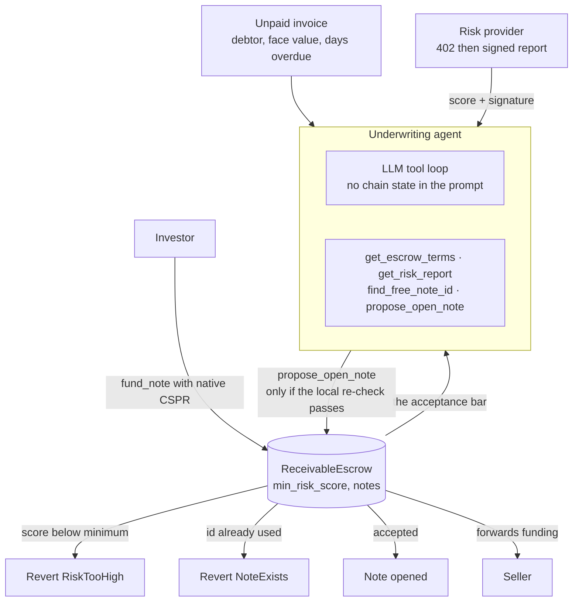

# Invoice Factoring Agent

**An unpaid invoice becomes a funded receivable note, and the underwriter never
gets to pick its own acceptance bar.**

An AI agent reads the escrow's terms **from the contract**, buys a signed risk
score over an x402-style endpoint, and opens a receivable note. Investors fund
notes with native CSPR, which the escrow forwards to the seller.

**Repository:** [github.com/kamalbuilds/casper-invoice-factoring-agent](https://github.com/kamalbuilds/casper-invoice-factoring-agent)

---

## Why this is not the other 77 finalists

Most agentic underwriters in this field decide with a fixed if-ladder in
TypeScript while an LLM writes prose next to it. Here the model gets no chain
state in its prompt: it must call `get_escrow_terms` to learn the minimum risk
score the contract enforces, `get_risk_report` to buy signed debtor data, and
`propose_open_note` to act.

Three layers must agree before a note opens:

1. the model chooses to call `propose_open_note`
2. this process re-checks the request against live contract state
3. the contract re-checks `min_risk_score` and note uniqueness, and reverts

Only the third is authoritative. The first two exist so a failure is cheap and
legible instead of costing gas. A test asserts that changing only the *on-chain*
threshold flips the outcome for an identical tool call, which is what "the model
does not set the bar" actually means.

---

## Architecture



---

## Run it in under 5 commands

```bash
git clone https://github.com/kamalbuilds/casper-invoice-factoring-agent && cd casper-invoice-factoring-agent
(cd contract && rustup toolchain install nightly-2026-01-01 --profile minimal && cargo test)
(cd agent && npm install && npm test)
```

12 contract tests and 11 agent tests, fully offline: no API key, no node, no
secret. To run the flow locally, start the risk provider with
`cd agent && npm run provider`, then `npm run cli:good` (or `cli:risky` to watch
it refuse) in a second shell.

---

## On-chain proof

Casper **testnet** (`casper-test`).

| What | Hash | Status |
|---|---|---|
| Package | `1c7b0dfe3d37d1c7acaed683b5e0f6183fe144c5daa39a361b6d3b50d850efec` | [contract-package](https://testnet.cspr.live/contract-package/1c7b0dfe3d37d1c7acaed683b5e0f6183fe144c5daa39a361b6d3b50d850efec) — resolves |
| Contract | `984243631528b25918c69364ba6c28893b061d1c90858e1872b7c8c0f56a8cb8` | live |

**The contract has no transaction activity yet.** The explorer reports "No
activity to display" for this package. It is deployed and readable; no
`open_note` or `fund_note` has been executed on chain. This README claims
deployment and nothing more.

That is the honest state, and it is the single biggest gap in this project. The
underwriting logic, the refusal paths and the contract invariants are covered by
23 passing tests; none of that is the same as a settled note on a live network.

---

## Honest limits

- **No executed flow on chain.** See above. Deployment is proven; execution is not.
- **The debtor set is a fixture.** `agent/src/debtors.json` and `invoices.json`
  are sample data. There is no integration with an accounting system, an
  invoicing platform, or a credit bureau.
- **The risk score is signed by our own provider**, with a shared HMAC secret.
  It is a working payment-and-signature handshake, not an independent credit
  oracle, and a third party cannot verify a report from the chain alone.
- **No repayment or default path.** The contract opens and funds notes. What
  happens when the debtor pays late, partially, or never is not modelled.
- **No secondary market.** A note is not transferable.
- **One module, 7 entrypoints.** Deliberately small.
- **Testnet only.** Nothing here is on mainnet.

---

## Tests and CI

| Suite | Count | Command |
|---|---:|---|
| Contract | 12 | `cd contract && cargo test` |
| Agent | 11 | `cd agent && npm test` |

The agent suite was mutation-checked: disabling the minimum-risk re-check in
`underwriting-tools.ts` fails two tests, and it was restored green. Other tests
cover the decimal-string to motes conversion at amounts where a float would
round, and the account-hash encoding bug where `toJSON()` emits an unhyphenated
form that `Key.newKey` rejects.

CI (`.github/workflows/ci.yml`) runs the agent job, the contract job, and a
**clean-clone** job that installs from a fresh clone. `contract/Cargo.lock` is
committed so a judge resolves the same Odra 2.8.2 the tests were written
against, and `contract/rust-toolchain` pins the compiler. No CI job touches the
network or reads a secret, so a green badge means the code is correct, not that
testnet was up.

---

## After the hackathon

The full plan, with dates and costs, is in [ROADMAP.md](ROADMAP.md), including
who this is for and who it is explicitly not for. The short version:

**The testnet contract stays up.** `ReceivableEscrow` stays deployed at `1c7b0dfe…` and every deploy hash in this
README will keep resolving for as long as the network keeps testnet history. A
v2 gets a new package hash, listed in ROADMAP.md alongside the old one and
marked superseded rather than deleted.

**Who runs it.** The authors in `git log`. Through 2026 the commitment is
deliberately small so that it stays credible: security reports triaged within 72
hours, and the deployed contract left in place. A larger promise from a
hackathon team is not one a reader should believe.

**What ships next**, in order: open and fund one note on chain, because the contract currently has no transaction activity at all and that is the project's credibility gap, then trigger `RiskTooHigh` and `NoteExists` live, then model the repayment and default path which is most of what factoring actually is.

**Where to reach us.** We have no X account and no Discord. Rather than register
a handle with nothing behind it, the repo is the channel:

- [GitHub Issues](https://github.com/kamalbuilds/casper-invoice-factoring-agent/issues) for bugs, questions and security reports
- [Live demo](https://casper-invoice-factoring.vercel.app)

---

## License

MIT
